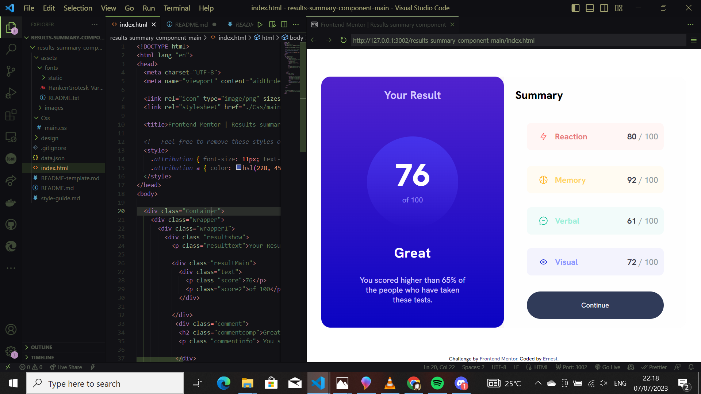

# Frontend Mentor - Results summary component solution

This is a solution to the [Result-summary-component-main](https://www.frontendmentor.io/challenges/results-summary-component-CE_K6s0maV). Frontend Mentor challenges help you improve your coding skills by building realistic projects. 

## Table of contents

- [Overview](#overview)
  - [The challenge](#the-challenge)
  - [Screenshot](#screenshot)
  - [Links](#links)
- [My process](#my-process)
  - [Built with](#built-with)
- [Author](#author)

## Overview

### The challenge

Users should be able to:

- View the optimal layout for the interface depending on their device's screen size
- See hover and focus states for all interactive elements on the page

### Screenshot

### Links

- Solution URL: [solution Netlify](https://64a87f9d51861f11cd3a223f--rad-florentine-15e2bf.netlify.app/)

## Author

- Website - [Ernest](https://64a87f9d51861f11cd3a223f--rad-florentine-15e2bf.netlify.app/)
- Frontend Mentor - [@Ernestsomto](https://www.frontendmentor.io/profile/Ernestsomto)
- Twitter - [@LeronErnest](https://www.twitter.com/Leronernest)

